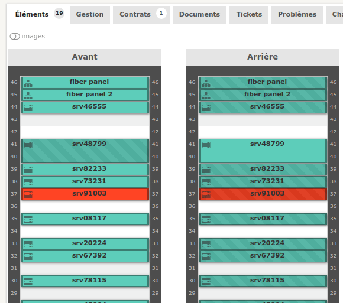
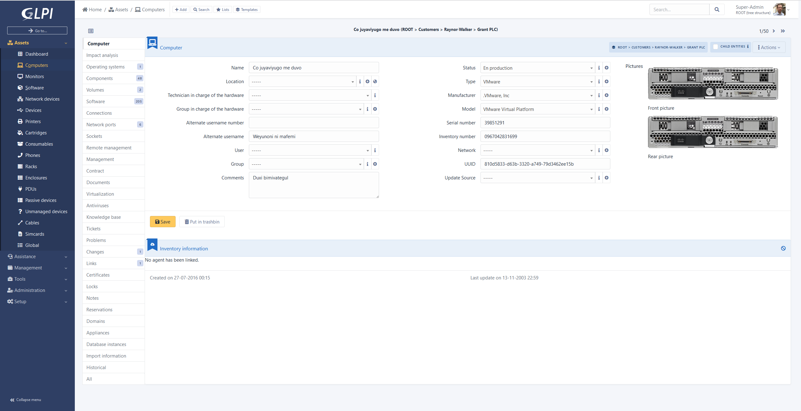

## About GLPI

GLPI stands for **Gestionnaire Libre de Parc Informatique** is a Free Asset and IT Management Software package, that provides ITIL Service Desk features, licenses tracking and software auditing.

GLPI features:
* Inventory of computers, peripherals, network printers and any associated components through an interface, with inventory tools such as: [FusionInventory](http://fusioninventory.org/) or [OCS Inventory](https://www.ocsinventory-ng.org/)
* Data Center Infrastructure Management (DCIM)
* Item lifecycle management
* Licenses management (ITIL compliant)
* Management of warranty and financial information (purchase order, warranty and extension, damping)
* Management of contracts, contacts, documents related to inventory items
* Incidents, requests, problems and changes management
* Knowledge base and Frequently-Asked Questions (FAQ)
* Asset reservation

Moreover, GLPI supports many [plugins](http://plugins.glpi-project.org) that provide additional features.

## Demonstration

Check GLPI features by asking for a free personal demonstration on **[glpi-network.cloud](https://www.glpi-network.cloud)**

## License

It is distributed under the GNU GENERAL PUBLIC LICENSE Version 3 - please consult the file called [LICENSE](https://raw.githubusercontent.com/glpi-project/glpi/main/LICENSE) for more details.

## Some screenshots

**Tickets**

**DCIM**

**Assets**

**Dashboards**

## Prerequisites

* A web server (Apache, Nginx, IIS, etc.)
* MariaDB >= 10.2 or MySQL >= 5.7
* PHP (See compatibility matrix below)

    | GLPI Version | Minimum PHP | Maximum PHP |
    | ------------ | ----------- | ----------- |
    | 9.4.X        | 5.6         | 7.4         |
    | 9.5.X        | 7.2         | 8.0         |
    | 10.0.X       | 7.4         | 8.1         |
* Mandatory PHP extensions:
    - dom, fileinfo, json, session, simplexml (these are enabled in PHP by default)
    - curl (access to remote resources, like inventory agents, marketplace API, RSS feeds, ...)
    - gd (pictures handling)
    - intl (internationalization)
    - libxml (XML handling)
    - mysqli (communication with database server)
    - zlib (handling of compressed communication with inventory agents, installation of gzip packages from marketplace, PDF generation)

* Suggested PHP extensions
    - exif (security enhancement on images validation)
    - ldap (usage of authentication through remote LDAP server)
    - openssl (email sending using SSL/TLS)
    - zip and bz2 (installation of zip and bz2 packages from marketplace)

 * Supported browsers:
    - Edge
    - Firefox (including 2 latest ESR versions)
    - Chrome

Please, consider using browsers on editor's supported version

## Download

See :
* [releases](https://github.com/glpi-project/glpi/releases) for tarball packages.

## Documentation

* [GLPI Administrator](https://glpi-install.readthedocs.io)
    * Install & Update
    * Command line tools
    * Timezones
    * Advanced configuration
    * [Contribute to this documentation!](https://github.com/glpi-project/doc-install)

* [GLPI User](https://glpi-user-documentation.readthedocs.io)
    * First Steps with GLPI
    * Overview of all modules
    * Configuration & Administration
    * Plugins & Marketplace
    * GLPI command-line interface
    * [Contribute to this documentation!](https://github.com/glpi-project/doc)

* [GLPI Developer](https://glpi-developer-documentation.readthedocs.io)
    * Source Code management
    * Coding standards
    * Developer API
    * Plugins Guidelines
    * Packaging
    * [Contribute to this documentation!](https://github.com/glpi-project/docdev)

* [GLPI Agent](https://glpi-agent.readthedocs.io)
    * Installation (Windows / Linux / Mac OS / Source)
    * Configuration / Settings
    * Usage / Execution mode
    * Tasks / HTTP Interface / Plugins
    * Bug reporting / Man pages
    * [Contribute to this documentation!](https://github.com/glpi-project/doc-agent)

## Additional resources

* [Official website](http://glpi-project.org)
* [Demo](https://www.glpi-network.cloud)
* [Translations on transifex service](https://www.transifex.com/glpi/public/)
* [Issues](https://github.com/glpi-project/glpi/issues)
* [Suggestions](http://suggest.glpi-project.org)
* [Forum](http://forum.glpi-project.org)
* [Development documentation](http://glpi-developer-documentation.readthedocs.io/en/master/)
* [Plugin directory](http://plugins.glpi-project.org)
* [Plugin development documentation](http://glpi-developer-documentation.readthedocs.io/en/master/plugins/index.html)

## Support
GLPI is a living software. Improvements are continuously made, new functionalities are being developed, and issues are being fixed.

To ease support and development, we need your help when encountering issues.
There is a GLPI version typical lifecycle:
 * A new major version (9.3) is released.
 * Minor versions (9.3.x), fixing bugs or issues, are published after several weeks.
   Please consider updating to the latest released minor version if you encounter some bugs or performance issues.
 * Several months after major version released, a new major version (9.4) is released.
   Previous major versions become unsupported, please update to the new major version.
   Obviously, we provide support for the migration tools too!
